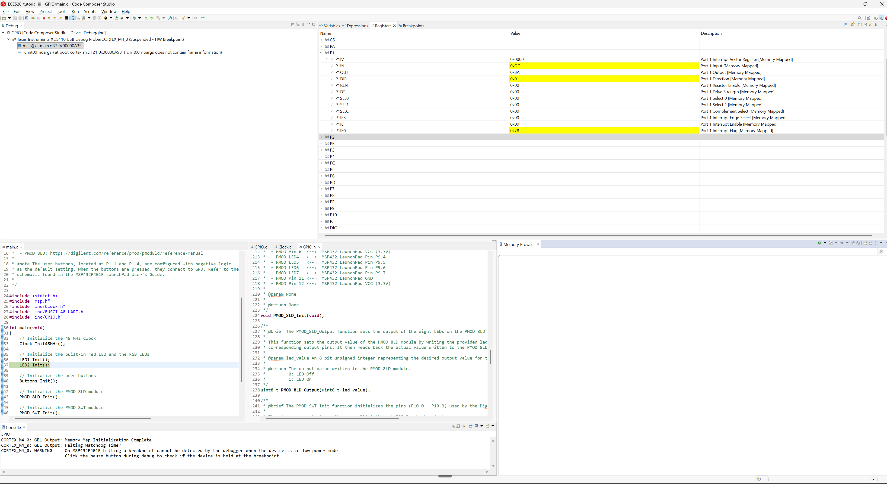
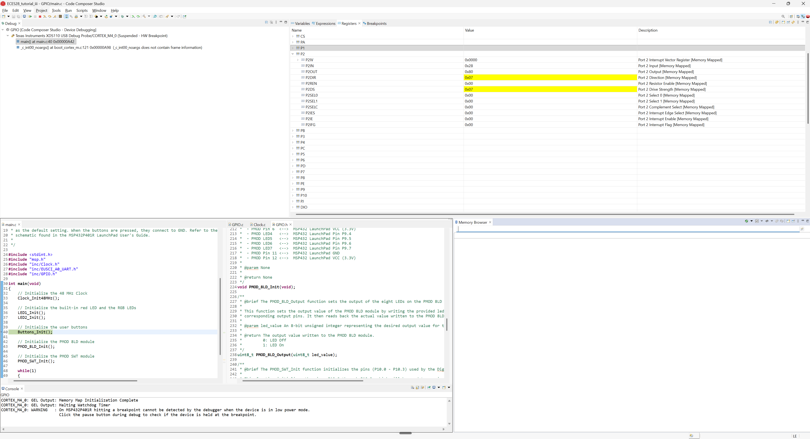
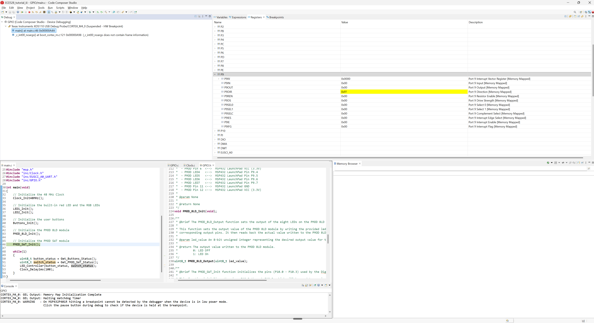
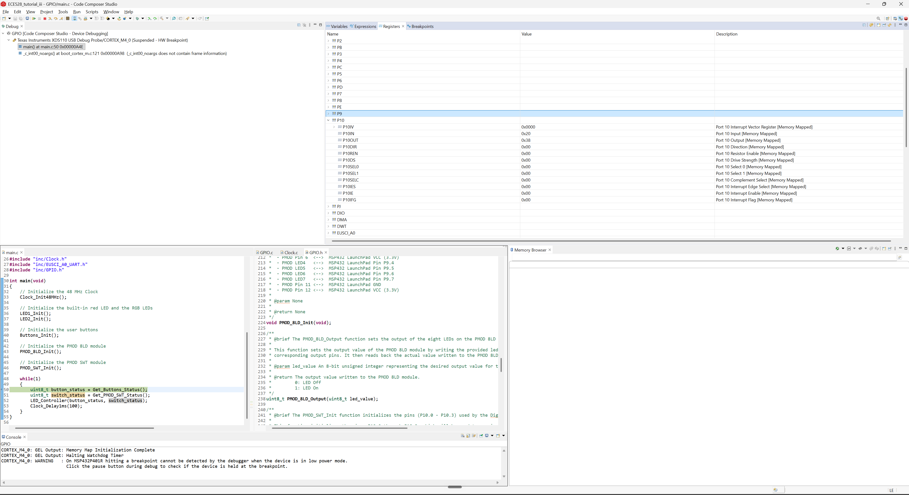

# ECE 528/L - Lab 0: GPIO

**CSU Northridge**

**Department of Electrical and Computer Engineering**

## Overview

This lab focuses on the General-Purpose Input/Output (GPIO) interface of the MSP432
LaunchPad and introduces basic functionality such as reading input from the two switches
and controlling the two LED outputs. In addition, the values of the memory-mapped
registers of the Input/Output (I/O) ports are observed.

The `LED_Controller()` function selects an LED pattern based on the PMOD SWT status:

- **All switches off** - `LED_Pattern_1()`, output set by the two user buttons
- **SWT1** - `LED_Pattern_2()`, binary up counter, 100 ms
- **SWT2** - `LED_Pattern_3()`, binary down counter, 100 ms
- **SWT1 and SWT2** - `Johnson_Counter()`, Johnson (twisted ring) counter, 200 ms
- **SWT3** - `LED_Pattern_4()`, ring counter shifting left, 200 ms
- **SWT4** - `LED_Pattern_5()`, ring counter shifting right, 200 ms

## Components Used
- TI MSP432P401R Launch Pad
- USB-A to Micro-USB Cable
- PMOD 8LD (Digilent), connected to P9.0 - P9.7
- PMOD SWT (Digilent), connected to P10.0 - P10.3
- Code Composer Studi

## Analysis and Results

With all switches off, the user buttons set the outputs. The user buttons are connected on Pins P1_1 and P1_4 for buttons 1 and 2, respectively.  The buttons are active low, so
`Get_Buttons_Status` returns 0x00, 0x02, 0x10, 0x12

- **Button 1** - LED 1 on, RGB LED off, PMOD 8LD 0x55
- **Button 2** - LED 1 off, RGB LED blue, PMOD 8LD 0xAA
- **Both** - LED 1 and green RGB LED toggle every 1 second, PMOD 8LD off
- **Neither** - LED 1 off, RGB LED off, PMOD 8LD 0xFF

Screenshots were taken during debugging by expanding each port in the Regsiter window.

#### Port 1 - after LED1_Init

#### Port 2 - after LED2_Init

#### Port 9 - after PMOD_8LD_Init

#### Port 10 - after PMOD_SWT_Init

## Known Issues or Limitations

- Windows Smart App Control blocked Code Composer Studio from loading `xdsboard.dll`,
  causing a "Debugger Initialization Error." Disabling it resolved the issue.

## Author Contribution

This lab was completed individually.

## References

- ECE 528/L Lab 0: General Purpose Input Output (GPIO)
- [MSP432P401R SimpleLink Microcontroller LaunchPad Development Kit User's Guide](https://docs.rs-online.com/3934/A700000006811369.pdf)
- [MSP432P4xx SimpleLink Microcontrollers Technical Reference Manual](https://web.archive.org/web/20200402132841/http:/www.ti.com/lit/ug/slau356i/slau356i.pdf)
- [PMOD SWT Reference Manual](https://digilent.com/reference/pmod/pmodswt/reference-manual)
- [PMOD 8LD Reference Manual](https://digilent.com/reference/pmod/pmod8ld/reference-manual)